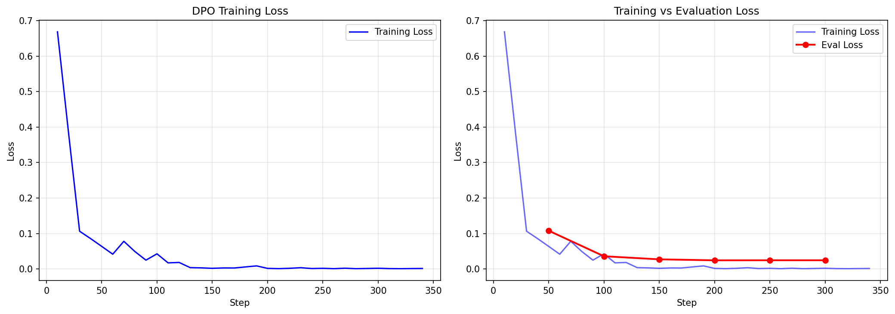
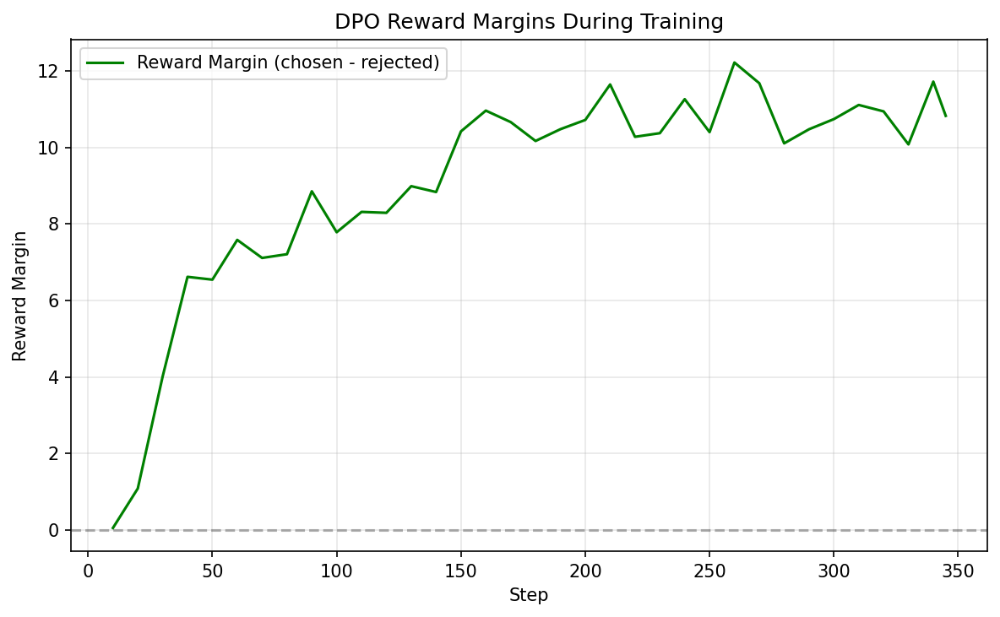
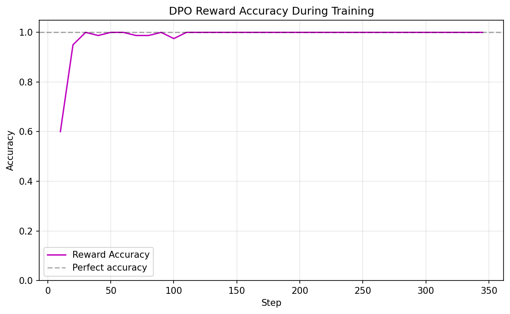
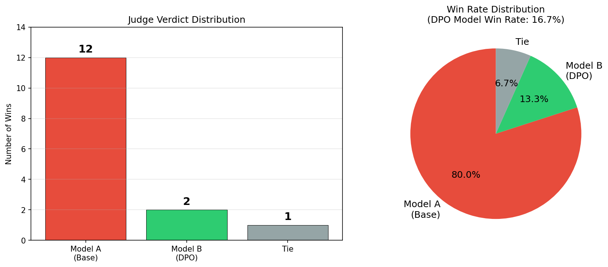

# A5: Optimization Human Preference & LLM-as-a-Judge

**NLU Assignment 5** — DPO Training & LLM-as-a-Judge Evaluation  
**Student**: Dechathon Niamsa-ard [st126235]

---

## Overview

This project implements **Direct Preference Optimization (DPO)** to fine-tune a pre-trained language model using human preference data, then evaluates the improvement using an **LLM-as-a-Judge** approach based on the AlpacaEval benchmark. The base model (`Qwen/Qwen2.5-1.5B-Instruct`) is fine-tuned with QLoRA (4-bit NF4 quantization) on the `jondurbin/truthy-dpo-v0.1` preference dataset, and the resulting model is compared against the original using Gemini as an automatic judge.

---

## Project Structure

```
├── assets/                           # Saved visualizations & diagrams
├── lab_05/                           # Lab reference notebooks
│   ├── 04-DPO.ipynb
│   └── dpo-qlora-4bit.py
├── model/                            # Saved model artifacts
│   └── dpo-qwen2.5-1.5b/           # DPO-trained LoRA adapter
│       ├── adapter_config.json      # LoRA configuration
│       ├── adapter_model.safetensors # LoRA adapter weights
│       ├── tokenizer.json           # Tokenizer
│       ├── tokenizer_config.json    # Tokenizer configuration
│       ├── chat_template.jinja      # Chat template
│       ├── checkpoint-300/          # Training checkpoint at step 300
│       └── checkpoint-345/          # Training checkpoint at step 345
├── st126235_assignment_5.ipynb  # Main notebook (Tasks 1–4)
├── pyproject.toml                    # Project config & dependencies
└── README.md                         # This file
```

---

## Quick Start

```bash
# Setup environment
uv venv && uv sync
# Or: pip install torch transformers trl peft bitsandbytes datasets accelerate google-genai pandas matplotlib python-dotenv huggingface_hub

# Run the notebook
jupyter notebook "st126235_assignment_5.ipynb"
```

---

## Task 1: Dataset Preparation (0.5 point)

**Objective**: Load and prepare the preference dataset for DPO training.

### Dataset: truthy-dpo-v0.1

- **Source**: [jondurbin/truthy-dpo-v0.1](https://huggingface.co/datasets/jondurbin/truthy-dpo-v0.1)
- A focused preference dataset designed to teach models to be **truthful** and **avoid hallucinations**
- Fields: `prompt` (user instruction), `chosen` (factual/correct answer), `rejected` (hallucinated/incorrect answer)
- Converted to conversational message format expected by TRL's `DPOTrainer`

| Split | Size |
|-------|:---:|
| Total | 1,016 |
| Train (90%) | 914 |
| Eval (10%) | 102 |

---

## Task 2: Training a Model with DPOTrainer (2 points)

**Objective**: Implement DPO training with a pre-trained model and experiment with hyperparameters.

### Base Model & Quantization

| Component | Configuration |
|-----------|---------------|
| Base Model | `Qwen/Qwen2.5-1.5B-Instruct` |
| Quantization | QLoRA 4-bit NF4 + double quantization |
| LoRA Rank (r) | 64 |
| LoRA Alpha | 128 (scaling ratio = 2.0) |
| LoRA Dropout | 0.05 |
| Target Modules | `q_proj`, `k_proj`, `v_proj`, `o_proj`, `gate_proj`, `up_proj`, `down_proj` |

### DPO Training Configuration

| Setting | Value |
|---------|-------|
| Epochs | 3 |
| Batch Size | 2 x 4 grad_accum = 8 effective |
| Learning Rate | 5e-5 |
| LR Scheduler | Cosine |
| Warmup Steps | 34 (~10% of total) |
| Beta (DPO) | 0.1 |
| Max Length | 1024 |
| Steps per Epoch | ~114 |
| Total Steps | ~345 (actual) |
| Seed | 42 |

### Training Results

| Metric | Start (Step 10) | Mid (Step 170) | End (Step 340) | Trend |
|---|---|---|---|---|
| Training Loss | 0.668 | 0.003 | 0.002 | Steadily decreasing — strong convergence |
| Eval Loss | 0.108 (Step 50) | 0.027 (Step 150) | 0.025 (Step 300) | Stable — no overfitting |
| Reward Margin | 0.053 | 10.67 | 11.73 | Model clearly distinguishes chosen vs rejected |
| Reward Accuracy | 60% | 100% | 100% | Reached 100% early and sustained |

### Training Curves





### Hyperparameter Experimentation

- **Beta (0.1 vs 0.3):** `beta=0.1` selected for stronger preference optimization signal.
- **Learning Rate (5e-5 vs 5e-6):** `5e-5` chosen because LoRA trains only ~4.6% of parameters, tolerating higher LR.
- **LoRA Rank (64 vs 32):** Rank 64 provides more capacity for preference patterns; overfitting risk mitigated by small dataset and dropout.
- **Epochs (3 vs 5):** 3 epochs sufficient — training loss near-zero by end of epoch 1, eval loss stable throughout.
- **Max Length (1024 vs 512):** Set to 1024 to fully capture long chosen/rejected pairs without truncation.

---

## Task 3: Pushing the Model to Hugging Face Hub (0.5 point)

**Objective**: Save the trained LoRA adapter weights and tokenizer, then upload to Hugging Face Hub.

**Uploaded Model**: [dniamsaard4codework/qwen2.5-1.5b-instruct-dpo-truthy](https://huggingface.co/dniamsaard4codework/qwen2.5-1.5b-instruct-dpo-truthy)

---

## Task 4: Evaluation — LLM-as-a-Judge with AlpacaEval (2 points)

**Objective**: Evaluate whether DPO training improved the model using an LLM judge.

### Evaluation Pipeline

1. **Load AlpacaEval** — `helpful_base` subset from [`tatsu-lab/alpaca_eval`](https://huggingface.co/datasets/tatsu-lab/alpaca_eval)
2. **Sample** — 15 prompts (seed=42 for reproducibility)
3. **Generate** — Responses from both Base Model and DPO Model (greedy decoding, `max_new_tokens=256`)
4. **Judge** — Gemini (`gemini-3.1-pro-preview`) evaluates each pair and outputs "Model A", "Model B", or "Tie"
5. **Calculate Win Rate**:

$$Win~Rate = \frac{Model~B~Wins + (0.5 \times Ties)}{Total~Evaluations} \times 100$$

### Evaluation Results

| Metric | Value |
|---|---|
| Model A (Base) wins | 12 / 15 |
| Model B (DPO) wins | 2 / 15 |
| Ties | 1 / 15 |
| **DPO Win Rate** | **16.7%** |



The Base model outperformed the DPO model on general helpfulness prompts. This is expected because the DPO model was trained on a **truthfulness-specific** dataset (`truthy-dpo-v0.1`), while the evaluation uses **general helpfulness** prompts from `helpful_base`. A domain-matched evaluation (e.g., TruthfulQA) would better capture the DPO model's improvements.

### Evaluation Configuration

| Setting | Value |
|---------|-------|
| Eval Dataset | `tatsu-lab/alpaca_eval` (helpful_base) |
| Sample Size | 15 |
| Judge Model | `gemini-3.1-pro-preview` |
| Decoding Strategy | Greedy (do_sample=False) |
| Max New Tokens | 256 |
| System Prompt | "You are a helpful assistant." |

---

## Dataset Sources

| Dataset | Description | Source |
|---------|-------------|--------|
| truthy-dpo-v0.1 | Preference dataset for truthfulness (DPO training) | [jondurbin/truthy-dpo-v0.1](https://huggingface.co/datasets/jondurbin/truthy-dpo-v0.1) |
| AlpacaEval | Evaluation benchmark for LLM-as-a-Judge | [tatsu-lab/alpaca_eval](https://huggingface.co/datasets/tatsu-lab/alpaca_eval) |

---

## Technical Notes

- **QLoRA**: 4-bit NF4 quantization with double quantization reduces memory footprint while preserving model quality.
- **GPU Support**: Trained on NVIDIA GPU with PyTorch and CUDA. BF16 mixed precision enabled.
- **Reproducibility**: Fixed seed (42) for dataset splitting, sampling, and training. Greedy decoding ensures deterministic generation.
- **LoRA Adapter**: Only ~4.6% of parameters are trainable (73.9M / 1.62B), enabling efficient fine-tuning on consumer hardware.

---

## References

- Rafailov, R., Sharma, A., Mitchell, E., et al. (2023). *Direct Preference Optimization: Your Language Model is Secretly a Reward Model.* [arXiv:2305.18290](https://arxiv.org/abs/2305.18290)
- Dettmers, T., et al. (2023). *QLoRA: Efficient Finetuning of Quantized Language Models.* [arXiv:2305.14314](https://arxiv.org/abs/2305.14314)
- TRL DPOTrainer Documentation — https://huggingface.co/docs/trl/main/dpo_trainer
- Dataset: `jondurbin/truthy-dpo-v0.1` — https://huggingface.co/datasets/jondurbin/truthy-dpo-v0.1
- AlpacaEval Benchmark — https://huggingface.co/datasets/tatsu-lab/alpaca_eval
- Uploaded Model — https://huggingface.co/dniamsaard4codework/qwen2.5-1.5b-instruct-dpo-truthy

---

## Requirements

- Python 3.11+
- PyTorch 2.9+
- Flask 3.1+
- scikit-learn 1.7+
- HuggingFace Datasets 4.5+
- HuggingFace Transformers 5.1+
- NumPy 2.3+
- Matplotlib 3.10+
- tqdm 4.67+

See `pyproject.toml` for full dependencies.

---